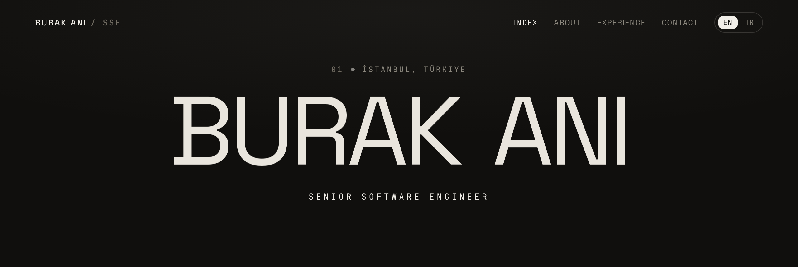

  

  
  &nbsp;
  
  &nbsp;
  

 

I build reliable, well-structured backend systems: complex integrations, system migrations, and modernizing legacy code into clean, modular architectures. I care about systems that stay correct under load, and code the next engineer can read without a map.

**Currently** building the backend of a new neo-bank from the ground up.

---

### Stack

**Languages & frameworks** 

**Architecture** 

**Data** 

**Messaging & infrastructure** 

---

<a href="https://burakani.dev">burakani.dev</a>

